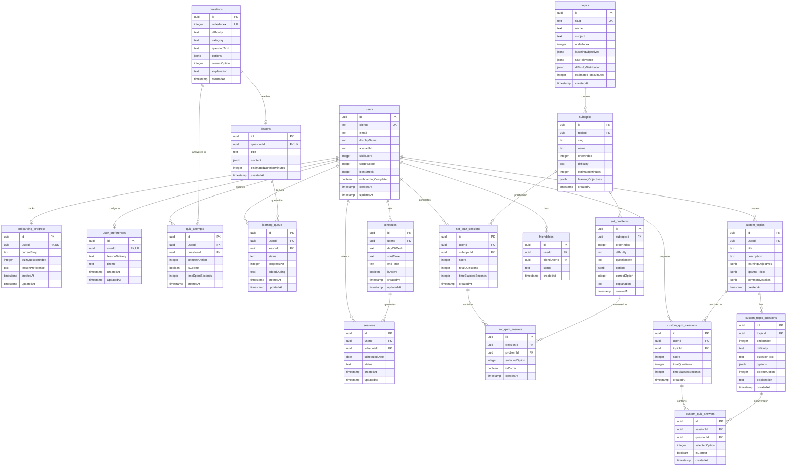

# Athena — SAT Math Prep Platform

AI-powered SAT Math preparation that combines adaptive tutoring with structured accountability. Built on the thesis that **sustained behavioral momentum + precise conceptual feedback** drives student outcomes.

## Tech Stack

| Layer | Technology |
|-------|-----------|
| Framework | Next.js 15 (App Router, TypeScript) |
| Auth | Clerk (Google login) |
| Database | Supabase (PostgreSQL) |
| ORM | Drizzle (no DrizzleKit) |
| UI | Tailwind CSS 4 + shadcn/ui |
| Animations | Framer Motion |
| AI Agent | Agno (Python/FastAPI) |

## Getting Started

### Prerequisites

- Node.js 20+
- pnpm
- A [Clerk](https://clerk.com) account
- A [Supabase](https://supabase.com) project

### 1. Configure environment

Add your keys to `.env`:

```bash
# Clerk
NEXT_PUBLIC_CLERK_PUBLISHABLE_KEY=pk_...
CLERK_SECRET_KEY=sk_...
NEXT_PUBLIC_CLERK_SIGN_IN_URL=/sign-in
NEXT_PUBLIC_CLERK_SIGN_UP_URL=/sign-up
NEXT_PUBLIC_CLERK_AFTER_SIGN_IN_URL=/onboarding
NEXT_PUBLIC_CLERK_AFTER_SIGN_UP_URL=/onboarding

# Supabase
NEXT_PUBLIC_SUPABASE_URL=https://<project-ref>.supabase.co
NEXT_PUBLIC_SUPABASE_PUBLISHABLE_DEFAULT_KEY=sb_publishable_...

# Drizzle — Supabase dashboard: Settings > Database > Connection string > URI (Transaction pooler)
DATABASE_URL=postgresql://postgres.<project-ref>:<password>@aws-0-<region>.pooler.supabase.com:6543/postgres

# Agent service
AGENT_SERVICE_URL=http://localhost:8000

# Email (Resend)
RESEND_API_KEY=re_...
EMAIL_FROM=Athena <noreply@yourdomain.com>
APP_URL=https://yourdomain.com

```

### 2. Setup and run

```bash
# Everything (Next.js + agents)
make agents-setup
make setup-all
make dev-all

# Or just Next.js
make setup
make dev
```

#### Env Setup
```bash
make secrets-login

# web-app
make secrets-sync #(choose athena-web)

cd agents
make secrets-sync
```

Open [http://localhost:3000](http://localhost:3000).

## Project Structure

```
src/
├── app/
│   ├── page.tsx                          # Public landing page
│   ├── layout.tsx                        # Root layout (Clerk + Theme providers)
│   ├── sign-in/                          # Clerk sign-in
│   ├── sign-up/                          # Clerk sign-up
│   ├── api/
│   │   ├── health/                       # DB health check
│   │   ├── user/                         # User sync & profile
│   │   ├── quiz/                         # Quiz questions, attempts, completion
│   │   ├── lessons/                      # Lesson content & progress
│   │   ├── learning-queue/               # Learning queue
│   │   ├── schedule/                     # Schedule creation & session generation
│   │   ├── dashboard/                    # Dashboard data aggregation
│   │   └── agent/chat/                   # Proxy to Agno tutor service
│   └── (protected)/
│       ├── onboarding/                   # Multi-step onboarding flow
│       │   ├── quiz/                     # Level-setting quiz
│       │   ├── schedule/                 # Weekly schedule picker
│       │   └── complete/                 # Celebration page
│       ├── dashboard/                    # Post-onboarding dashboard
│       └── learn/                        # Learning queue & lesson viewer
├── components/
│   ├── ui/                               # shadcn/ui primitives
│   ├── providers/                        # Theme provider
│   ├── layout/                           # Sidebar, nav
│   ├── onboarding/                       # Stepper, quiz, schedule components
│   ├── lessons/                          # Lesson viewer, Ask Athena
│   ├── learn/                            # Queue list & cards
│   └── dashboard/                        # Dashboard widgets
├── db/
│   ├── schema/                           # Drizzle table definitions
│   └── seed/                             # Seed data (25 questions + lessons)
├── lib/
│   ├── db/queries/                       # Database query functions
│   ├── utils.ts                          # cn() utility
│   ├── scoring.ts                        # Weighted skill score calculation
│   └── schedule-utils.ts                 # Session generation helpers
├── hooks/
│   └── use-current-user.ts               # Client-side user data hook
└── middleware.ts                          # Clerk route protection

agents/
├── main.py                               # FastAPI server
├── lesson_generator.py                   # Agno lesson generation agent
├── tutoring_agent.py                     # Agno tutoring agent
├── pyproject.toml                        # Python dependencies
└── Dockerfile
```

## Database Schema

| Table | Purpose |
|-------|---------|
| `users` | Clerk-synced user profiles with skill/target scores and streak |
| `onboarding_progress` | Tracks current onboarding step and quiz position |
| `user_preferences` | Lesson delivery preference and theme |
| `questions` | SAT onboarding quiz questions (easy/medium/hard) |
| `lessons` | Structured "aha moment" lesson content (JSONB) |
| `quiz_attempts` | Per-question answer records for onboarding quiz |
| `learning_queue` | Onboarding lessons queued for review with progress tracking |
| `schedules` | Weekly study time slots |
| `sessions` | Generated study sessions (planned/completed/missed) |
| `topics` | SAT topic areas (e.g. Algebra, Geometry) with metadata |
| `subtopics` | Subtopics within each topic with learning objectives |
| `sat_problems` | SAT practice problems per subtopic |
| `sat_quiz_sessions` | Completed SAT quiz sessions with score and time |
| `sat_quiz_answers` | Per-problem answer records for SAT quiz sessions |
| `friendships` | Friend relationships between users (pending/accepted) |
| `custom_topics` | AI-generated topics created by users in My Learning |
| `custom_topic_questions` | Questions generated for custom topics |
| `custom_quiz_sessions` | Completed quiz sessions for custom topics |
| `custom_quiz_answers` | Per-question answer records for custom quiz sessions |

### ER Diagram



## SAT Score Calculation

Full SAT scores use a **piecewise linear approximation** of College Board equating tables (`src/lib/full-sat/scoring.ts`).

### How it works

1. **Raw score** = number of correct answers per section
2. **Ratio** = raw correct / total questions
3. **Scaled score** = piecewise linear interpolation (200–800 per section)
4. **Composite** = R&W scaled + Math scaled (400–1600)

### Scaling curves

**Reading & Writing** (54 questions):

| Ratio | Scaled Score |
|-------|-------------|
| ≥ 96% | 800 |
| 89–95% | 750–800 |
| 78–88% | 650–750 |
| 63–77% | 530–650 |
| 44–62% | 400–530 |
| 26–43% | 300–400 |
| 11–25% | 230–300 |
| < 11% | 200–230 |

**Math** (44 questions):

| Ratio | Scaled Score |
|-------|-------------|
| ≥ 98% | 800 |
| 91–97% | 750–800 |
| 80–90% | 650–750 |
| 64–79% | 530–650 |
| 45–63% | 400–530 |
| 27–44% | 300–400 |
| 11–26% | 230–300 |
| < 11% | 200–230 |

### Profile display

The profile page shows the **latest completed full SAT attempt** only — total composite, R&W scaled, Math scaled, and completion date. Sourced from `full_sat_attempts` table via `getLastCompletedAttempt()`.

## Key Flows

### Onboarding

1. **Sign in** via Google (Clerk)
2. **Level-setting quiz** — 25 SAT Math questions, adaptive feedback
3. On first wrong answer: choose "View lesson now" or "Queue for later"
4. **Skill score** calculated with difficulty weighting (easy=1, medium=2, hard=3)
5. **Schedule commitment** — pick weekly study days and time windows
6. 4 weeks of sessions auto-generated

### Dashboard

- Upcoming sessions with day/time
- Streak and completion metrics
- Learning queue preview
- Session completion and streak tracking

### Lessons

- Structured sections: Explanation → Walkthrough → Insight
- Progressive reveal with section-by-section progress
- "Ask Athena" AI follow-up panel (requires agent service)

## Email Notifications

Email is powered by [Resend](https://resend.com). Two notification types:

### Welcome Email
Sent automatically when a new user first logs in and gets created in the database (via `/api/user/sync`). No webhooks — triggered purely by app logic.

### Daily Session Reminders
A cron endpoint sends reminder emails 1–2 hours before each user's scheduled study session.

Runs as a background loop inside the FastAPI agents service (`agents/app/cron/session_reminders.py`). Every 30 minutes it:

1. Queries sessions for today/tomorrow where `status = 'planned'` and `reminder_sent_at IS NULL`
2. For each session, computes the actual datetime using `scheduled_date + start_time` in the user's timezone
3. If the session is 1–2 hours away, sends the reminder via Resend
4. Marks `reminder_sent_at` on the session to prevent duplicates

No external cron service needed — starts automatically when the agents service boots.

**Key files:**
- `agents/app/cron/session_reminders.py` — reminder loop + email templates
- `src/lib/email/` — email client/templates for welcome emails (Next.js side)

## Make Commands

Run `make help` to see all available commands.

### Quick Start

```bash
make setup-all   # Install everything (Next.js + agents)
make dev-all     # Start both services concurrently
```

### Next.js

| Command | Description |
|---------|-------------|
| `make install` | Install Node dependencies |
| `make setup` | Full Next.js setup (install + schema + seed) |
| `make dev` | Start Next.js dev server |
| `make build` | Production build |
| `make lint` | Run ESLint |

### Database

Schema is managed directly via Supabase (no DrizzleKit). Drizzle is used as a query builder only.

| Command | Description |
|---------|-------------|
| `make db-seed` | Seed questions and lessons |

### Agno Agents

| Command | Description |
|---------|-------------|
| `make agents-setup` | Create Python venv and install dependencies |
| `make agents-dev` | Run agent service locally (no Docker) |
| `make agents-docker` | Start agent service via Docker Compose |
| `make agents-docker-down` | Stop agent service |

### Combined

| Command | Description |
|---------|-------------|
| `make setup-all` | Full setup for both Next.js and agents |
| `make dev-all` | Start both Next.js and agent service concurrently |
| `make clean` | Remove build artifacts and generated files |
